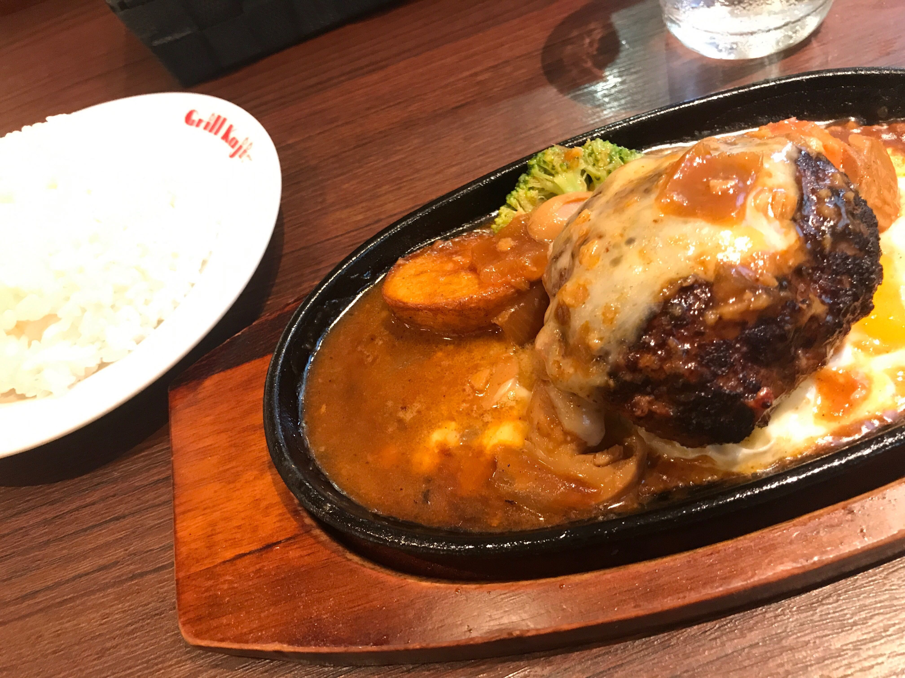

## Contents

- this is sample article 1
- Picture

## This is sample article 1

You can write articles by markdown.
[marked](https://www.npmjs.com/package/marked) convert from markdown to HTML on this blog system.

## You can use h2 and...

### h3

hogehogehogehoge

#### h4

hogehogehogehoge

##### h5

hogehogehogehoge

###### h6

hogehogehogehogehogehogehogehogehogehogehogehogehogehogehogehogehogehogehogehogehogehogehogehogehogehogehogehogehogehogehogehogehogehogehogehogehogehogehogehogehogehogehogehogehogehogehogehogehogehogehogehogehogehogehogehogehogehogehogehogehogehogehogehogehogehogehogehogehogehogehogehogehogehogehogehogehogehogehogehogehogehogehogehogehogehogehogehogehogehogehogehogehogehogehogehogehogehogehogehogehogehogehogehogehogehogehogehogehogehogehogehogehogehogehogehogehogehogehogehogehogehogehogehogehogehogehogehogehogehogehogehogehogehogehogehogehogehogehogehogehogehogehogehoge

## list

- You
- can
- use
- list

## picture

You can add pictures on the articles

